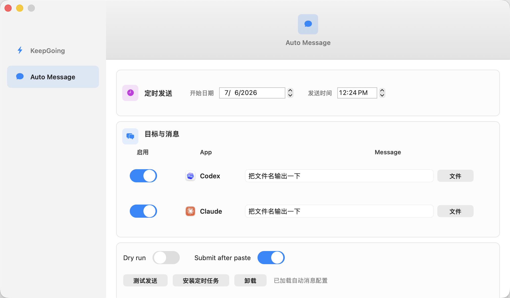
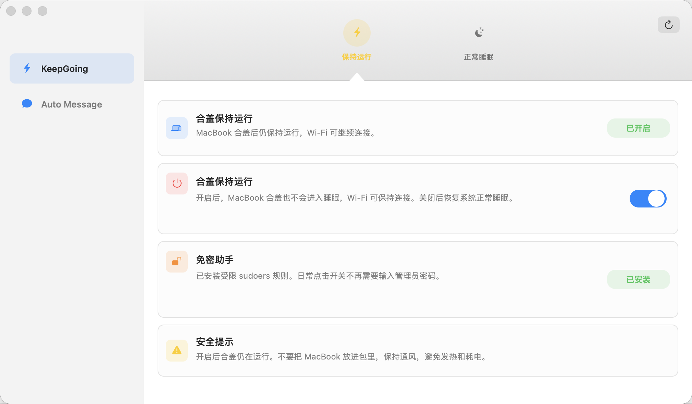

# Iverson’s WorkTool

> A small local macOS utility for people who live with AI agents open all day.

Iverson’s WorkTool is a native macOS app built for a very specific workflow: keep the machine awake when long agent tasks are running, and schedule plain-language prompts plus original file attachments to Codex and Claude.

It is not trying to be a full automation platform. It is closer to a quiet daily workbench for researchers, PhD students, writers, and developers who repeatedly start the same AI-agent routines.

### Auto Message



### KeepGoing



## Why this exists

If you use Codex or Claude every day, the annoying part is often not the model.

It is the ritual around the model:

- open the right app
- paste the same morning prompt
- attach the right paper, spreadsheet, script, or draft
- hit submit
- make sure the computer does not sleep halfway through a long run

Iverson’s WorkTool turns that repeated setup into a small local app.

## Features

### KeepGoing

KeepGoing toggles macOS power settings so long-running work is less likely to be interrupted by sleep.

- Enable or disable keep-awake mode
- Uses a small helper for `pmset`
- Installs and uninstalls the helper from the app UI

### Auto Message

Auto Message schedules prompts to Codex and Claude.

- Pick a start date
- Pick a daily send time
- Enable or disable each target
- Write a different message for Codex and Claude
- Attach one or more original files
- Optionally submit after paste
- Install or uninstall the macOS LaunchAgent from the app UI

Files are attached as original files. They are not expanded into plain text before being sent.

## Supported Targets

The app currently has fixed rows for:

- Codex
- Claude

This is intentional. The project was built around one personal workflow first. More targets can be added later, but the current version optimizes for these two apps.

## Installation

### Option 1, download a release

1. Download the latest `.zip` from GitHub Releases.
2. Unzip it.
3. Move `Iverson’s WorkTool.app` to `/Applications`.
4. Open the app.
5. Grant the permissions described below.

Release builds are currently ad-hoc signed and not notarized by Apple. macOS may show a Gatekeeper warning on first launch. If you are uncomfortable with that, build from source instead.

### Option 2, build from source

Requirements:

- macOS 12 or later
- Xcode Command Line Tools

Build:

```bash
./Scripts/build_app.sh
```

Output:

```text
dist/Iverson’s WorkTool.app
```

## Permissions

This app needs Accessibility access for automation.

Open:

```text
System Settings -> Privacy & Security -> Accessibility
```

Allow:

- `Iverson’s WorkTool`, for manual test sends from the app
- `keepgoing-automessage`, for scheduled sends from the LaunchAgent helper

Why this is needed:

- activate Codex or Claude
- focus the chat input
- paste text
- paste file attachments
- press Return when `Submit after paste` is enabled

## Privacy

Iverson’s WorkTool is local-first.

- No analytics
- No telemetry
- No network upload
- No remote server
- No cloud sync

Messages and selected file paths are stored locally at:

```text
~/Library/Application Support/KeepGoing/auto-message.json
```

Scheduled logs are stored locally at:

```text
~/Library/Application Support/KeepGoing/Logs/
```

The selected files are placed on the macOS pasteboard as file attachments for the target app. The app itself does not read and upload the file contents.

See [PRIVACY.md](PRIVACY.md) for the longer version.

## Auto Message Scheduling

The schedule uses a macOS LaunchAgent:

```text
~/Library/LaunchAgents/com.iverson.keepgoing.automessage.plist
```

The app writes and loads this file when you click `Install Schedule`.

Click `Uninstall` to unload and remove it.

If you uninstall the schedule, no future scheduled send should run.

## KeepGoing Helper

KeepGoing uses:

```text
/usr/local/bin/keepgoing-helper
```

The helper is a zsh script bundled in `Resources/keepgoing-helper`, not a compiled binary.

The helper calls `pmset` through a limited sudoers rule:

```text
/etc/sudoers.d/keepgoing
```

Helper commands:

```bash
keepgoing-helper status
keepgoing-helper enable
keepgoing-helper disable
```

## Tests

Run the lightweight behavior tests:

```bash
./Scripts/run_tests.sh
```

Build the app:

```bash
./Scripts/build_app.sh
```

## Project Layout

```text
Sources/             Swift Cocoa source
Resources/           icon, helper, install scripts
Scripts/             build and test scripts
Tests/               lightweight Swift behavior tests
docs/screenshots/    screenshots for README and releases
dist/                local build output, ignored by Git
```

## Release Checklist

Before publishing a release:

1. Run `./Scripts/run_tests.sh`.
2. Run `./Scripts/build_app.sh`.
3. Zip `dist/Iverson’s WorkTool.app`.
4. Create a GitHub Release.
5. Upload the zip.
6. Mention that users must grant Accessibility permission.

## Non-affiliation

This project is not affiliated with OpenAI, Anthropic, Codex, or Claude.

Product names are used only to describe the local apps this utility can automate.

## License

MIT. See [LICENSE](LICENSE).
